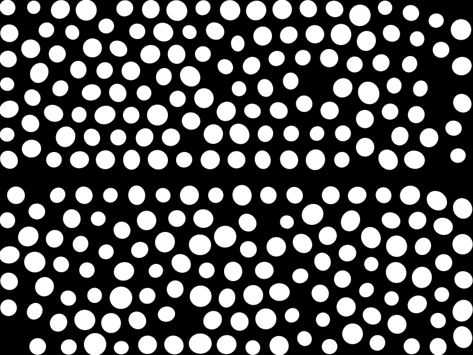

# Frogo

Frogo is a Go-based application that generates a set of dots and applies forces to them to create a visually appealing distribution. The final output is saved as an SVG file, and a PNG conversion is also provided. I created this to mimic the effect of a glass frog.


This tool only gives you the first stage to create this effect.



I use another tool called [stipplegen](https://github.com/evil-mad/stipplegen/) to generate the final output.


The cool thing about using stipplegen is that you can then print this final design on a pen plotter.

## Features

- Generates a specified number of dots within a defined width and height.
- Applies forces to the dots to achieve an ideal spacing.
- Saves the output as an SVG file.
- Converts the SVG file to a PNG format.

## Installation

To use Frogo, you need to have Go installed on your machine. You can download and install Go from [here](https://golang.org/dl/).

Clone the repository:
```sh
git clone https://github.com/wjhrdy/frogo.git
cd frogo
```

## Usage

To run Frogo, use the following command:
```sh
go run main.go
```

## Contributing

Contributions are welcome! If you find any issues or have suggestions for improvements, please open an issue or submit a pull request.

## License

This project is licensed under the MIT License. See the `LICENSE` file for more details.
