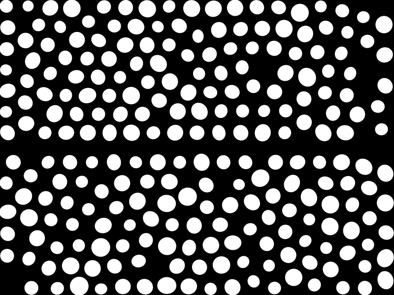

# Frogo

Frogo is a Go-based application that generates a set of dots and applies forces to them to create a visually appealing distribution. The final output is saved as an SVG file, and a PNG conversion is also provided. I created this to mimic the effect of a glass frog.


This tool only gives you 2 stages to create this effect.




The first stage is to generate the dots and apply forces to them to create a visually appealing distribution.
The second stage approximates the dots with stipples to create a realistic glass frog pattern.
You can use the second stage to create a realistic glass frog patterns.


Another tool called [stipplegen](https://github.com/evil-mad/stipplegen/) can be used to generate the final output from the first stage.
The cool thing about using stipplegen is that you can then draw this final design on a pen plotter.

## Features

- Generates a specified number of dots within a defined width and height.
- Applies forces to the dots to achieve an ideal spacing.
- Saves the output as an SVG file.
- Converts the SVG file to a PNG format.
- Approximates the dots with stipples to create a realistic glass frog pattern.

## Installation

To use Frogo, you need to have Go installed on your machine. You can download and install Go from [here](https://golang.org/dl/).

Clone the repository:
```sh
git clone https://github.com/wjhrdy/frogo.git
cd frogo
```

## Usage

To run Frogo, use the following command:
```sh
go run main.go
```

### Customization

Frogo allows you to customize various parameters to generate different kinds of images. Here are some of the magic numbers in the script that you can edit:

- `numDots`: This parameter defines the number of dots to be generated. Increasing or decreasing this number will result in more or fewer dots in the final image.
- `width` and `height`: These parameters define the dimensions of the canvas. You can change these values to adjust the size of the output image.
- `forceStrength`: This parameter controls the strength of the forces applied to the dots. Modifying this value will affect how the dots are distributed.
- `stippleIterations`: This parameter determines the number of iterations for the stippling process. Higher values will result in a more detailed stippled pattern.

To customize these parameters, you can edit the corresponding variables in the `main.go` file before running the script.

### Additional Hardcoded Numbers

In addition to the customizable parameters mentioned above, there are several other hardcoded numbers in the `main.go` file that play a crucial role in the image generation process. Here is an explanation of what these numbers do:

- `dotRadius`: This parameter defines the radius of each dot. It affects the size of the dots in the final image.
- `maxForceDistance`: This parameter sets the maximum distance over which forces are applied between dots. It influences how far apart the dots can be while still interacting with each other.
- `minDistance`: This parameter specifies the minimum distance allowed between any two dots. It ensures that the dots do not overlap or get too close to each other.
- `initialVelocity`: This parameter sets the initial velocity of the dots when the forces are first applied. It affects how quickly the dots start moving and distributing themselves.
- `dampingFactor`: This parameter controls the rate at which the velocity of the dots decreases over time. It helps in stabilizing the movement of the dots and achieving a balanced distribution.
- `stippleRadius`: This parameter defines the radius of the stipples used in the second stage of the process. It affects the size and detail of the stippled pattern.

These hardcoded numbers are set to default values that work well for generating a realistic glass frog pattern, but you can experiment with different values to see how they affect the final output. To modify these parameters, you can edit the corresponding variables in the `main.go` file before running the script.

### Additional Hardcoded Numbers not in variables

In addition to the customizable parameters and hardcoded numbers mentioned above, there are other hardcoded numbers in the `main.go` file that play a crucial role in the image generation process. Here is an explanation of what these numbers do:

- `0.8` and `0.4` in the line `radius: dotRadius * (0.8 + rand.Float64()*0.4)`: These numbers are used to scale the radius of each dot randomly within a range. The radius is scaled between 80% and 120% of the `dotRadius` value.
- `2 * math.Pi` in the line `rotation: rand.Float64() * 2 * math.Pi`: This number represents the full circle in radians (360 degrees). It is used to assign a random rotation angle to each dot between 0 and 2π radians.
- `30` in the line `avoidanceHeight = 30`: This number defines the height of the area to avoid around the center line of the canvas.
- `0.9` and `0.2` in the lines `xScale: 0.9 + rand.Float64()*0.2` and `yScale: 0.9 + rand.Float64()*0.2`: These numbers are used to scale the x and y dimensions of each dot randomly within a range. The scales are between 90% and 110%.
- `0.0` in the lines `dx, dy := 0.0, 0.0`: These numbers initialize the change in x and y positions of each dot to zero before applying forces.
- `0.7` and `0.6` in the line `densityFactor := 1.3 - 0.6*distFromCenter`: These numbers are used to adjust the density factor for drawing dots based on their distance from the center line. The density factor decreases as the distance from the center increases.
- `4.5` in the line `dotRadius := minDist / 4.5`: This number is used to calculate the radius of the stipples based on the minimum distance between points in the Poisson Disk Sampling process.

These hardcoded numbers are set to default values that work well for generating a realistic glass frog pattern, but you can experiment with different values to see how they affect the final output. To modify these parameters, you can edit the corresponding lines in the `main.go` file before running the script.


## Contributing

Contributions are welcome! If you find any issues or have suggestions for improvements, please open an issue or submit a pull request.

## License

This project is licensed under the MIT License. See the `LICENSE` file for more details.
